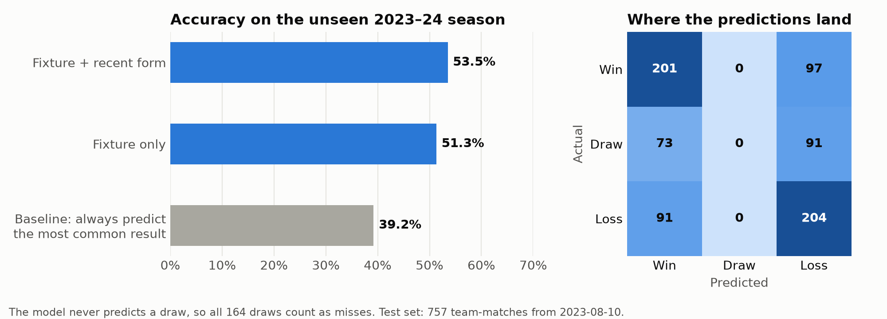

# Premier League Match Prediction

[](https://github.com/FuaadBashi/Premier-League-Outcome-Predictor/actions/workflows/ci.yml)

Predicting Premier League results (win, draw or loss) with a random forest trained on five
seasons of match data scraped from fbref.com. The model is trained on 2019–2023 and tested on
the whole 2023–24 season, which it has never seen.

```
Baseline (always predict the most common result): 39.2%

Model                     Train   Test   Accuracy  Precision
Fixture only               3040    760      51.3%      40.3%
Fixture + recent form      2962    757      53.5%      42.0%

When the model predicts one side wins and the other loses: 153/245 correct (62.4%)
```

<p align="center"></p>

The model never predicts a draw, so every draw in the test season counts as a miss. That's the
clearest place to improve. `python plot_results.py` regenerates the chart from a fresh run (it
needs `matplotlib`).

## Approach

1. **Data.** [`scraper.py`](scraper.py) collects each club's match log and shooting stats per
   season: goals, xG, shots, shots on target, shot distance, possession, penalties, free kicks.
   The bundled dataset in [`data/`](data) has 3,800 team-match rows (2019–20 to 2023–24).
2. **Fixture features.** Venue, opponent, kick-off hour and day of the week, encoded as
   integers. The opponent and venue codes are learned from training rows only.
3. **Form features.** Rolling averages of each team's last three matches for eleven stats, using
   *strictly earlier* matches (`closed="left"`).
4. **Model.** `RandomForestClassifier` (1,000 trees, `min_samples_split=100`), evaluated on a
   chronological split, never a random shuffle.
5. **Consistency check.** Every fixture appears twice, once from each side. Pairing the two
   predictions shows how often the model is right when both views agree: one side wins and the
   other loses.

## Avoiding data leakage

Match predictions are easy to overstate by accident, so the pipeline is built to prevent it:

- **No same-match statistics.** Possession, shots and xG for the match being predicted are not
  used, because none of them is known before kick-off.
- **Only past matches in form features.** Rolling features include only matches played before the
  predicted one. A test changes future rows and checks that past features don't move.
- **Categories learned from training data.** A club first seen in the test period, such as a newly
  promoted side, gets a separate "unknown" code.
- **Chronological split.** Every test match is played after every training match.

## Getting started

Requires Python 3.10+.

```bash
git clone https://github.com/FuaadBashi/Premier-League-Outcome-Predictor.git
cd Premier-League-Outcome-Predictor
python3 -m venv .venv && source .venv/bin/activate
pip install -r requirements.txt
python predict.py                          # train on 2019–2023, test on 2023–24
python predict.py --split-date 2022-08-05  # test on 2022–23 onwards instead
python scraper.py                          # re-scrape (slow: it pauses between requests)
```

## Project structure

```
features.py   feature engineering and leakage safeguards
predict.py    training, evaluation, report
scraper.py    fbref.com scraper
data/         bundled match data
tests/        pytest suite
```

## Tests

```bash
pip install -r requirements.txt pytest ruff
pytest
ruff format --check . && ruff check .
```
